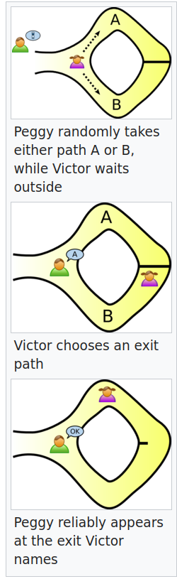

<!--
theme: base-theme
style: |
  section {
    background-color: #ccc;
    color: #FFFFFF;
  }
  h1 {
    color: #09c;
  }

  header {
    color: #ccc;
  }
  h2 {
    color: #09c;
  }
paginate: true
header: Blockdevs Asia: Zero-Knowledge Proofs
backgroundImage: "url(bg_bda_ppt.jpg)"

-->

# Welcome!
- I'm Caspar Oostendorp, CTO of Oost&Voort Inc.
- We build blockchain and cloud solutions
- For an example of what we do: We are now participating in the https://ethglobal.com/events/autonomous hackathon. Deadline is in 3 days!
- I made this presentation to educate others, and to force myself to understand this topic better. If you want to try that sometime, let us know!

---

<!-- header: Current events -->

# Some current events..

- [It was a data leak, not a breach or a hack – PNP](https://newsinfo.inquirer.net/1761100/pnp-it-was-a-data-leak-not-a-breach-or-a-hack)
- [Update on alleged law enforcement data leak in Philippines. Data of nearly 1.5 million American Bar Association members compromised.](https://thecyberwire.com/newsletters/privacy-briefing/5/78)
- [Don’t collect data you can’t protect: Philippine privacy commissioner](https://asianews.network/dont-collect-data-you-cant-protect-philippine-privacy-commissioner/)

    “We would also like to have this opportunity to remind those who process personal data that they concomitantly have the duty to protect the data they collect. Do not collect if you can’t protect,” Naga added.

---

# We are oversharing:
- Proving age: Showing drivers license. Only the birth date being BEFORE a certain date matters, but you're sharing much more than that.
- Proving citizenship: Many will copy your ID or passport, even though most of it is none of their business and can even leak and be abused.
- Proving funds: Right now we share a bank statement with current balance, even though the only info needed is that we have funds ABOVE a certain amount.
- Diplomatic: Countries that want to prove they have no nuclear weapons, without needing to expose their actual arsenal

---
<!-- header: Important terms -->

# Some important terms before we begin

--- 

## What is Blockchain?

---

Blockchain is a decentralized technology that enables secure and transparent recording of transactions or data across multiple computers. It eliminates the need for a central authority and ensures data integrity and immutability. It has applications in various industries, including finance, supply chain, and voting systems.

---

## What is Ethereum?

---

Ethereum is a decentralized blockchain platform for creating and running smart contracts. It enables developers to build applications and organizations that operate without central authorities. Ethereum's cryptocurrency, Ether (ETH), powers the network and incentivizes participants. Its programmable nature has led to broad adoption in various industries, including finance, gaming, and DeFi.

---

## What is an Algorithm?

---

An algorithm is a set of step-by-step instructions or rules used to solve a problem or perform a specific task. It is a precise sequence of actions that takes inputs and produces outputs. 
They form the foundation of computer programs, guiding the logic and operations necessary to achieve desired outcomes. 

---

## What is Elliptic Curve Cryptography?

---

Elliptic Curve Cryptography (ECC) is a cryptographic algorithm that uses the mathematics of elliptic curves to provide secure communication and encryption. It offers strong security with shorter key lengths compared to traditional encryption algorithms like RSA. ECC operates on the principle that it is computationally difficult to solve certain mathematical problems related to elliptic curves.

---

## What is Public Key and Private Key cryptography?

---
Public Key and Private Key cryptography, also known as asymmetric cryptography, is a cryptographic system that uses a pair of keys to encrypt and decrypt data. The keys are mathematically related but asymmetric, meaning that data encrypted with one key can only be decrypted with the corresponding key from the pair. The public key is freely shared and used for encryption, while the private key is kept secret and used for decryption. This system allows secure communication and authentication without the need for a shared secret key. 

---

## What is a Hash Function?

---

A function that can be used to map data of arbitrary size to data of fixed size. The values returned by a hash function are called hash values, hash codes, or simply hashes. They are extensively used in blockchain technology.

---

# An Overview of Zero-Knowledge Proofs
## How They Work and Why They Matter

 
---
<!-- header: What are zero-knowledge proofs? -->
## What are zero-knowledge proofs?

A zero-knowledge proof is a way of proving the validity of a statement without revealing the statement itself. The ‘prover’ is the party trying to prove a claim, while the ‘verifier’ is responsible for validating the claim.

Zero-knowledge proofs first appeared in a 1985 paper, “[The knowledge complexity of interactive proof systems](http://people.csail.mit.edu/silvio/Selected%20Scientific%20Papers/Proof%20Systems/The_Knowledge_Complexity_Of_Interactive_Proof_Systems.pdf)” which provides a definition of zero-knowledge proofs widely used today:

--- 
> A zero-knowledge protocol is a method by which one party (the prover) can prove to another party (the verifier) that something is true, without revealing any information apart from the fact that this specific statement is true.

Zero-knowledge proofs have improved over the years and they are now being
used in several real-world applications.

--- 
<!-- header: How do zero-knowledge proofs work? -->
## How do zero-knowledge proofs work?

### Interactive vs Non-interactive
- Interactive: **Prover** performs a random test on request of **Verifier**, and every time it gives expected outcome, it is more convicing the **Prover** is not faking it
- Non-Interactive: **Prover** and **Verifier** agree on a set of rules that a system need to follow. Every time **Prover** uses the system, hash-based proofs are generated by the system. Since both trust the system, **Verifier** can check if the proofs are aligned with a properly functioning system, while the actual input/output stay hidden.

--- 
<!-- header: How do zero-knowledge proofs work? - Interactive -->
### Interactive 

A good example that illustrates how interactive proofs work is Jean-Jacques Quisquater’s famous [Ali Baba cave story](https://en.wikipedia.org/wiki/Zero-knowledge_proof#The_Ali_Baba_cave). In the story, Peggy (the prover) wants to prove to Victor (the verifier) that she knows the secret phrase to open a magic door without revealing the phrase.

---

---

A zero-knowledge proof allows you to prove the truth of a statement without sharing the statement’s contents or revealing how you discovered the truth. To make this possible, zero-knowledge protocols rely on algorithms that take some data as input and return ‘true’ or ‘false’ as output.

A zero-knowledge protocol must satisfy the following criteria:

--- 
1. **Completeness**: If the input is valid, the zero-knowledge protocol always returns ‘true’. Hence, if the underlying statement is true, and the **Prover** and **Verifier** act honestly, the proof can be accepted.

2. **Soundness**: If the input is invalid, it is theoretically impossible to fool the zero-knowledge protocol to return ‘true’. Hence, a lying **Prover** cannot trick an honest **Verifier** into believing an invalid statement is valid (except with a tiny margin of probability).

3. **Zero-knowledge**: The **Verifier** learns nothing about a statement beyond its validity or falsity (they have “zero knowledge” of the statement). This requirement also prevents the **Verifier** from deriving the original input (the statement’s contents) from the proof.

--- 
In basic form, a zero-knowledge proof is made up of three elements: **witness**, **challenge**, and **response**.

--- 
- **Witness**: With a zero-knowledge proof, the **Prover** wants to prove knowledge of some hidden information. The secret information is the “witness” to the proof, and the **Prover**'s assumed knowledge of the witness establishes a set of questions that can only be answered by a party with knowledge of the information. Thus, the **Prover** starts the proving process by randomly choosing a question, calculating the answer, and sending it to the **Verifier**.

--- 
- **Challenge**: The **Verifier** randomly picks another question from the set and asks the **Prover** to answer it.

--- 
- **Response**: The **Prover** accepts the question, calculates the answer, and returns it to the **Verifier**. The **Prover** response allows the **Verifier** to check if the former really has access to the witness. To ensure the **Prover** isn’t guessing blindly and getting the correct answers by chance, the **Verifier** picks more questions to ask. By repeating this interaction many times, the possibility of the **Prover** faking knowledge of the witness drops significantly until the **Verifier** is satisfied.

--- 
The above describes the structure of an ‘interactive zero-knowledge proof’. Early zero-knowledge protocols used interactive proving, where verifying the validity of a statement required back-and-forth communication between provers and verifiers.

--- 
<!-- header: How do zero-knowledge proofs work? - Non-interactive -->
### Non-interactive zero-knowledge proofs 

Non-interactive zero-knowledge proofs are cryptographic primitives, where information between a **Prover** and a **Verifier** can be authenticated by the **Prover**, without revealing any of the specific information beyond the validity of the statement itself. This function of encryption makes direct communication between the **Prover** and **Verifier** unnecessary, effectively removing any intermediaries. 

The core trustless cryptography "proofing" involves a hash function generation of a random number, constrained within mathematical parameters (primarily to modulate hashing difficulties) determined by the **Prover** and **Verifier**.

---

The key advantage of non-interactive zero-knowledge proofs is that they can be used in situations where there is no possibility of interaction between the **Prover** and **Verifier**, such as in online transactions where the two parties are not able to communicate in real time. This makes non-interactive zero-knowledge proofs particularly useful in decentralized systems like blockchains, where transactions are verified by a network of nodes and there is no central authority to oversee the verification process.[2]

---

Most non-interactive zero-knowledge proofs are based on mathematical constructs like elliptic curve cryptography or pairing-based cryptography, which allow for the creation of short and easily verifiable proofs of the truth of a statement. Unlike interactive zero-knowledge proofs, which require multiple rounds of interaction between the **Prover** and **Verifier**, non-interactive zero-knowledge proofs are designed to be efficient and can be used to verify a large number of statements simultaneously.

--- 

### Examples of non-interactive zero-knowledge proof systems

--- 
#### ZK-SNARKs

- ZK-SNARK is an acronym for **Zero-Knowledge Succinct Non-Interactive Argument of Knowledge**. 
- Used in for example: ZCash, ZKSync

The ZK-SNARK protocol has the following qualities:

---

- **Zero-knowledge**: A verifier can validate the integrity of a statement without knowing anything else about the statement. The only knowledge the verifier has of the statement is whether it is true or false.

- **Succinct**: The zero-knowledge proof is smaller than the witness and can be verified quickly.

- **Non-interactive**: The proof is ‘non-interactive’ because the prover and verifier only interact once, unlike interactive proofs that require multiple rounds of communication.

- **Argument**: The proof satisfies the ‘soundness’ requirement, so cheating is extremely unlikely.

- **(Of) Knowledge**: The proof cannot be constructed without access to the secret information (witness). It is difficult, if not impossible, for a prover who doesn’t have the witness to compute a valid zero-knowledge proof.

--- 
The ‘shared key’ mentioned earlier refers to public parameters that the prover and verifier agree to use in generating and verifying proofs. Generating the public parameters (collectively known as the Common Reference String (CRS)) is a sensitive operation because of its importance in the protocol’s security. If the entropy (randomness) used in generating the CRS gets into the hands of a dishonest prover, they can compute false proofs.

--- 
[Multi-party computation (MPC)](https://en.wikipedia.org/wiki/Secure_multi-party_computation) is a way of reducing the risks in generating public parameters. Multiple parties participate in a [trusted setup ceremony](https://zkproof.org/2021/06/30/setup-ceremonies/amp/), where each person contributes some random values to generate the CRS. As long as one honest party destroys their portion of the entropy, the ZK-SNARK protocol retains computational soundness.

--- 
Trusted setups require users to trust the participants in parameter-generation. However, the development of ZK-STARKs has enabled proving protocols that work with a non-trusted setup.

---

#### ZK-STARKs

ZK-STARK is an acronym for **Zero-Knowledge Scalable Transparent Argument of Knowledge**. ZK-STARKs are similar to ZK-SNARKs, except that they are:

--- 

- **Scalable**: ZK-STARK is faster than ZK-SNARK at generating and verifying proofs when the size of the witness is larger. With STARK proofs, prover and verification times only slightly increase as the witness grows (SNARK prover and verifier times increase linearly with witness size).

- **Transparent**: ZK-STARK relies on publicly verifiable randomness to generate public parameters for proving and verification instead of a trusted setup. Thus, they are more transparent compared to ZK-SNARKs.

--- 
ZK-STARKs produce larger proofs than ZK-SNARKs meaning they generally have higher verification overheads. However, there are cases (such as proving large datasets) where ZK-STARKs may be more cost-effective than ZK-SNARKs.

--- 
<!--header: Use-cases for zero-knowledge proofs -->
## Use-cases for zero-knowledge proofs
- Anonymous payments
- Identity protection
- Authentication
- Verifiable computation
- Reducing bribery and collusion in on-chain voting

--- 
### Anonymous payments

Credit card payments are often visible to multiple parties, including the payments provider, banks, and other interested parties (e.g., government authorities). While financial surveillance has benefits for identifying illegal activity, it also undermines the privacy of ordinary citizens.

Cryptocurrencies were intended to provide a means for users to conduct private, peer-to-peer transactions. But most cryptocurrency transactions are openly visible on public blockchains. User identities are often pseudonymous and either wilfully linked to real-world identities (e.g. by including ETH addresses on Twitter or GitHub profiles) or can be associated with real-world identities using basic on and off-chain data analysis.

--- 
There are specific “privacy coins” designed for completely anonymous transactions. Privacy-focused blockchains, such as Zcash and Monero, shield transaction details, including sender/receiver addresses, asset type, quantity, and the transaction timeline.

By baking in zero-knowledge technology into the protocol, privacy-focused blockchain networks allow nodes to validate transactions without needing to access transaction data.

--- 
Zero-knowledge proofs are also being applied to anonymizing transactions on public blockchains. An example is Tornado Cash, a decentralized, non-custodial service that allows users to conduct private transactions on Ethereum. Tornado Cash uses zero-knowledge proofs to obfuscate transaction details and guarantee financial privacy. Unfortunately, because these are "opt-in" privacy tools they are associated with illicit activity. To overcome this, privacy has to eventually become the default on public blockchains.

--- 
### Identity protection

Current identity management systems put personal information at risk. Zero-knowledge proofs can help individuals validate identity whilst protecting sensitive details.

Zero-knowledge proofs are particularly useful in the context of [decentralized identity](/decentralized-identity/). Decentralized identity (also described as ‘self-sovereign identity’) gives the individual the ability to control access to personal identifiers. Proving your citizenship without revealing your tax ID or passport details is a good example of how zero-knowledge technology enables decentralized identity.

--- 
### Authentication

Using online services requires proving your identity and right to access those platforms. This often requires providing personal information, like names, email addresses, birth dates, and so on. You may also need to memorize long passwords or risk losing access.

--- 
Zero-knowledge proofs, however, can simplify authentication for both platforms and users. Once a ZK-proof has been generated using public inputs (e.g., data attesting to the user's membership of the platform) and private inputs (e.g., the user's details), the user can simply present it to authenticate their identity when they need to access the service. This improves the experience for users and frees organizations from the need to store huge amounts of user information.

--- 
### Verifiable computation

Verifiable computation is another application of zero-knowledge technology for improving blockchain designs. Verifiable computing allows us to outsource computation to another entity while maintaining verifiable results. The entity submits the result along with a proof verifying that the program was executed correctly.

Verifiable computation is critical to improving processing speeds on blockchains without reducing security. Understanding this requires knowing the differences in proposed solutions for scaling Ethereum.

--- 
[On-chain scaling solutions](/developers/docs/scaling/#on-chain-scaling), such as sharding, require extensive modification of the blockchain’s base layer. However, this approach is highly complex and errors in implementation can undermine Ethereum’s security model.

[Off-chain scaling solutions](/developers/docs/scaling/#off-chain-scaling) don’t require redesigning the core Ethereum protocol. Instead they rely on an outsourced computation model to improve throughput on Ethereum’s base layer.

--- 
Here’s how that works in practice:

- Instead of processing every transaction, Ethereum offloads execution to a separate chain.

- After processing transactions, the other chain returns the results to be applied to Ethereum’s state.

The benefit here is that Ethereum doesn’t have to do any execution and only needs to apply results from outsourced computation to its state. This reduces network congestion and also improves transaction speeds (off-chain protocols optimize for faster execution).

--- 
The chain needs a way to validate off-chain transactions without re-executing them, or else the value of off-chain execution is lost.

This is where verifiable computation comes into play. When a node executes a transaction outside of Ethereum, it submits a zero-knowledge proof to prove the correctness of off-chain execution. This proof (called a [validity proof](/glossary/#validity-proof)) guarantees that a transaction is valid, allowing Ethereum to apply the result to its state—without waiting for anyone to dispute it.

--- 
[Zero-knowledge rollups](/developers/docs/scaling/zk-rollups) and [validiums](/developers/docs/scaling/validium/) are two off-chain scaling solutions that use validity proofs to provide secure scalability. These protocols execute thousands of transactions off-chain and submit proofs for verification on Ethereum. Those results can be applied immediately once the proof is verified, allowing Ethereum to process more transactions without increasing computation on the base layer.

--- 
### Reducing bribery and collusion in on-chain voting

Blockchain voting schemes have many favorable characteristics: they are fully auditable, secure against attacks, resistant to censorship, and free of geographical constraints. But even on-chain voting schemes aren't immune to the problem of **collusion**.

Defined as “coordinating to limit open competition by deceiving, defrauding, and misleading others,” collusion may take the form of a malicious actor influencing voting by offering bribes. For example, Alice might receive a bribe from Bob to vote for `option B` on a ballot even if she prefers `option A`.

--- 
Bribery and collusion limit the effectiveness of any process that uses voting as a signaling mechanism (especially where users can prove how they voted). This can have significant consequences, especially where the votes are responsible for allocating scarce resources.

For example, [quadratic funding mechanisms](https://www.radicalxchange.org/concepts/plural-funding/) rely on donations to measure preference for certain options among different public good projects. Each donation counts as a "vote" for a specific project, with projects that receive more votes getting more funds from the matching pool.

--- 
Using on-chain voting makes quadratic funding susceptible to collusion: blockchain transactions are public, so bribers can inspect a bribee’s on-chain activity to see how they “voted”. This way quadratic funding ceases to be an effective means for allocating funds based on the aggregated preferences of the community.

--- 
Fortunately, newer solutions such as MACI (Minimum Anti-Collusion Infrastructure) are using zero-knowledge proofs to make on-chain voting (eg., quadratic funding mechanisms) resistant to bribery and collusion. MACI is a set of smart contracts and scripts that allow a central administrator (called a "coordinator") to aggregate votes and tally results _without_ revealing specifics on how each individual voted. Even so, it is still possible to verify that the votes were counted properly, or confirm that a particular individual participated in the voting round.

--- 
## Drawbacks of using zero-knowledge proofs
- Hardware costs
- Proof verification costs
- Trust assumptions
- Quantum computing threats

--- 
### Hardware costs

Generating zero-knowledge proofs involves very complex calculations best performed on specialized machines. As these machines are expensive, they are often out of the reach of regular individuals. Additionally, applications that want to use zero-knowledge technology must factor in hardware costs—which may increase costs for end-users.

--- 
### Proof verification costs

Verifying proofs also requires complex computation and increases the costs of implementing zero-knowledge technology in applications. This cost is particularly relevant in the context of proving computation. For example, ZK-rollups pay ~ 500,000 gas to verify a single ZK-SNARK proof on Ethereum, with ZK-STARKs requiring even higher fees.

--- 
### Trust assumptions

In ZK-SNARK, the Common Reference String (public parameters) is generated once and available for re-use to parties who wish to participate in the zero-knowledge protocol. Public parameters are created via a trusted setup ceremony, where participants are assumed to be honest.

But there’s really no way for users to assess the honesty of participants and users have to take developers at their word. ZK-STARKs are free from trust assumptions since the randomness used in generating the string is publicly verifiable. In the meantime, researchers are working on non-trusted setups for ZK-SNARKs to increase the security of proving mechanisms.

--- 
### Quantum computing threats

ZK-SNARK uses elliptic curve cryptography ([ECDSA](/glossary/#ecdsa)) for encryption. While the ECDSA algorithm is secure for now, the development of quantum computers could break its security model in the future.

ZK-STARK is considered immune to the threat of quantum computing, as it uses collision-resistant hashes for encryption. Unlike public-private key pairings used in elliptic curve cryptography, collision-resistant hashing is more difficult for quantum computing algorithms to break.

---

# Wrapping up 
- Non-interactive Zero-knowledge Proofs (NIZK) are the future!
- This presentation is shared online at https://github.com/blockdevsasia/meetups/tree/main/2023-05-20

- Any Questions?

---

## Further reading
- https://cointelegraph.com/explained/zk-starks-vs-zk-snarks-explained
- [Computer Scientist Explains One Concept in 5 Levels of Difficulty | WIRED](https://www.youtube.com/watch?v=fOGdb1CTu5c) - _Wired YouTube channel_
- [Overview of use cases for zero-knowledge proofs](https://appliedzkp.org/#Projects) — _Privacy and Scaling Explorations Team_
- [SNARKs vs. STARKS vs. Recursive SNARKs](https://www.alchemy.com/overviews/snarks-vs-starks) — _Alchemy Overviews_
- [A Zero-Knowledge Proof: Improving Privacy on a Blockchain](https://www.altoros.com/blog/zero-knowledge-proof-improving-privacy-for-a-blockchain/) — _Dmitry Lavrenov_
- [zk-SNARKs — A Realistic Zero-Knowledge Example and Deep Dive](https://medium.com/coinmonks/zk-snarks-a-realistic-zero-knowledge-example-and-deep-dive-c5e6eaa7131c) — _Adam Luciano_

--- 
- [ZK-STARKs — Create Verifiable Trust, even against Quantum Computers](https://medium.com/coinmonks/zk-starks-create-verifiable-trust-even-against-quantum-computers-dd9c6a2bb13d) — _Adam Luciano_
- [An approximate introduction to how zk-SNARKs are possible](https://vitalik.ca/general/2021/01/26/snarks.html) — _Vitalik Buterin_
- [What is Zero-Knowledge Proof and Its Role in Blockchain?](https://www.leewayhertz.com/zero-knowledge-proof-and-blockchain/) — _LeewayHertz_
